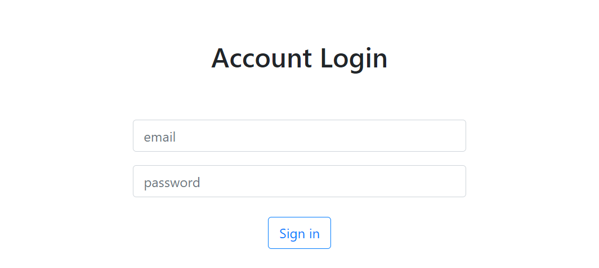

# User authentication 
簡單的帳號密碼登入專案，透過預設的帳號密碼可驗證是否能登入頁面


## 畫面瀏覽


## 預設帳號組
email: tony@stark.com
<br>
password: iamironman

email: captain@hotmail.com
<br>
password: icandothisallday

email: peter@parker.com
<br>
password: enajyram

email: natasha@gamil.com
<br>
password: *parol#@$!

email: nick@shield.com
<br>
password: password

## 建置環境
* node.js: 10.15.0
* express: ^4.17.1
* express-handlebars: ^5.3.2
* mongoose: ^5.13.2
* mongoDB: ^4.2.14

## 安裝流程

1. 在終端機輸入指令 clone 此專案至本機電腦
```
 git clone https://github.com/mush1200/user_authentication.git
 ```

2. 進入專案資料夾 
```
cd user_authentication
```

3. 安裝相關套件 
```
npm install
```

4. 安裝 nodemon 套件 (若未安裝)
```
npm install -g nodemon
```
5. 加入種子資料
```
npm run seed
```

6. 啟動專案 
```
npm run dev
```

7. 出現以下訊息後，即可在 http://localhost:3000 開始使用
<br>
The Express server is running on http://localhost:3000.